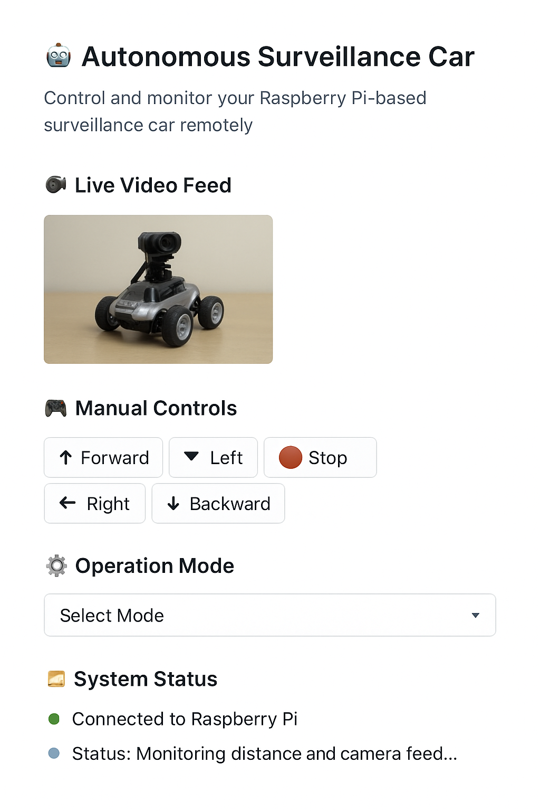

---

````markdown
# 🚗 Autonomous Surveillance Car

An AI-powered **Autonomous Surveillance Car** built using **Raspberry Pi**, **Python**, and **Streamlit**. It allows real-time video streaming, remote control, and smart autonomous navigation — all from an elegant, responsive web dashboard.

---

## 🧭 Project Overview
This project demonstrates how **edge AI** and **IoT** can be integrated for smart surveillance systems.  
The car operates in both **manual** and **autonomous** modes, streams live camera footage, and can be controlled remotely through a Streamlit dashboard. Designed for research, security, and robotics learning, it combines **computer vision**, **control automation**, and **web-based interaction** into one modular system.

---

## 🧠 Features
- 🎥 **Live Video Feed** — Real-time camera streaming via Raspberry Pi  
- 🎮 **Manual Controls** — Move the car and control the camera remotely  
- 🤖 **Autonomous Mode** — AI-based navigation and object detection  
- 🌐 **Streamlit Web Dashboard** — Vertical layout with modern design  
- ⚙️ **System Status** — Shows mode, connection, and uptime  

---

## 🧩 Tech Stack
- **Hardware:** Raspberry Pi 4, Pi Camera, Motor Driver, Sensors (Ultrasonic, IMU)  
- **Software:** Python, OpenCV, Streamlit, GPIO, TensorFlow Lite  
- **Frameworks:** Streamlit for UI, Flask (optional for streaming), TFLite for inference  

---
````
## 🚀 Setup Instructions
1. **Clone the repository**
   ```bash
   git clone https://github.com/<your-username>/autonomous-surveillance-car.git
   cd autonomous-surveillance-car
   ```

2. **Install dependencies**

   ```bash
   pip install -r requirements.txt
   ```

3. **Run the Streamlit app**

   ```bash
   streamlit run surveillance_app.py
   ```

4. **Access the dashboard**

   ```
   http://localhost:8501
   ```

---

## 📸 Preview



---

## 📂 Folder Structure

```
├── surveillance_app.py     # Streamlit web dashboard
├── camera_stream.py        # Handles live video feed
├── control_module.py       # Manual and autonomous control logic
├── requirements.txt
└── README.md
```

---

## 🧾 License

Licensed under the **MIT License** — free for modification and use in research or education.

---

## 👨‍💻 Author

**Mojesh Chinna**
AI & Embedded Systems Developer
🔗 [LinkedIn](https://www.linkedin.com/in/mojeshchinna)


